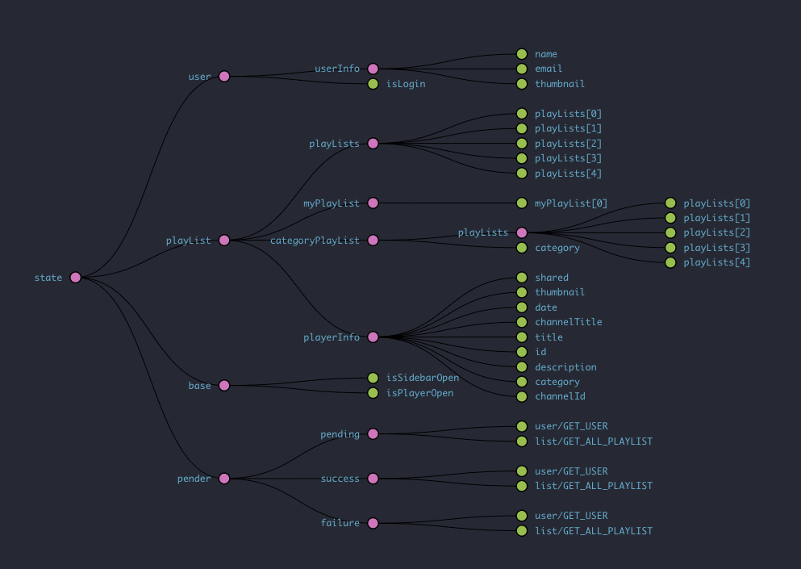

# PLAYLIST
자신의 유튜브 재생목록을 공유합니다.

### 실행 방법

* 모듈 설치 : cd frontend > yarn, cd backend > yarn , yarn global add nodemon (frontend폴더와 backend폴더의 모듈을 각각 설치합니다.)
* 환경 변수 설정 : backend폴더에 .env 파일을 만들고 아래 내용을 입력합니다.
* 실행
  * 클라이언트 실행 : frontend 경로에서 yarn start
  * 서버 실행 : backend 경로에서 yarn dev (윈도우 환경일 경우 )
  * DB: MongoDB도 실행되어야 합니다.
```
PORT=3001
clientID=424016644413-97qkuan5ht72qmolgsnd5drfcqj1q817.apps.googleusercontent.com
clientSecret=cF2tBAcIDy5MxIEi-QIrCwAn
JWT_SECRET=playlist_secret
MONGO_URI=mongodb://localhost:27017/playlist
```

### 사용 기술

* React, Redux, immutable.js, redux-pender
* youtube OAuth2.0, Data Api v3
* Koa.js, MongoDB, passport, jwt

### redux 구조



* user: 유저 정보, 로그인 상태
* playList: 내 재생목록, 전체 또는 카테고리 재생목록, 유튜브 플레이어 정보
* base: UI 변경 시에 사용
* pender: 비동기 작업 시 사용